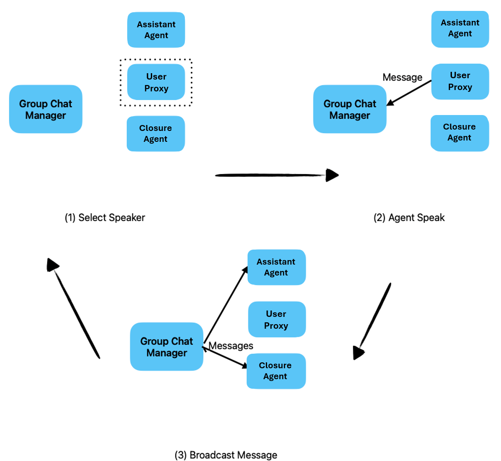

# Enterprise RAG Agentic Orchestrator

Part of [GPT-RAG](https://aka.ms/gpt-rag)

## Table of Contents

1. [**Concepts**](#concepts)
   - [1.1 How the Orchestrator Works](#how-the-orchestrator-works)
   - [1.2 Agent Creation and Strategies](#agent-creation-and-strategies)
   - [1.3 Create your Own Agent Strategy](#how-to-add-and-configure-you-own-agent-strategies)
2. [**Running the Orchestrator**](#running-the-orchestrator)
   - [2.1 Cloud Deployment](#cloud-deployment)
   - [2.2 Running the Chat Client Locally](#running-the-chat-client-locally)
   - [2.3 Running the Function Locally](docs/LOCAL_DEPLOYMENT.md)
3. [**NL2SQL Strategies Configuration**](#nl2sql-strategies-configuration)
   - [3.1 Configuring NL2SQL Strategies](#configuring-nl2sql-strategies)
   - [3.2 Data Dictionary and Query samples](#nl2sql-data)
   - [3.3 Database Connection Setup](#database-connection-setup)
   - [3.3.1 SQL Database Connection](#sql-database-connection)
   - [3.3.2 Teradata Connection](#teradata-connection)
4. [**Evaluation**](#evaluation)
5. [**Contributing**](#contributing)
6. [**Trademarks**](#trademarks)

---

## Concepts

### How the Orchestrator Works

The **GPT-RAG Agentic Orchestrator** is a powerful system that leverages AutoGen's group chat capabilities to facilitate collaboration among multiple specialized agents. This orchestrator is designed to handle complex tasks by coordinating the interactions of agents, each with a specific role, to produce coherent and accurate responses.

#### Architecture Overview

At its core, the orchestrator employs a factory pattern to create agents based on predefined strategies. The `AgentStrategyFactory` is responsible for instantiating the appropriate agents according to the selected strategy, such as `classic_rag` or `nl2sql`. Each strategy defines a unique set of agents, their roles, and how they interact within the group chat.

#### Agent Creation and Strategies

The orchestrator supports various strategies to address different types of queries and data interactions. For example:

- **Classic RAG Strategy (`classic_rag`)**: This strategy focuses on retrieval-augmented generation, where agents work together to retrieve relevant information from a knowledge base and generate responses grounded in that information.

- **NL2SQL Strategy (`nl2sql`)**: This strategy enables the system to translate natural language queries into SQL statements, allowing users to interact with databases using everyday language.

Each strategy defines how agents are created and configured. The creation code for each strategy involves:

1. **Creating Agents**: Agents are instantiated with specific roles and system messages. For instance, in the `classic_rag` strategy, the agents include:

   - **UserProxyAgent**: Acts as a proxy for the user, executing any function calls made by AssistantAgent
   - **AssistantAgent**: Responsible for generating responses, using the conversation history summarized for context.
   - **ChatClosureAgent**: Manages the closure of the conversation.

2. **Registering Functions**: Functions, which we can also refer to as tools, are registered to enable agents to perform specific tasks, such as retrieving data from a vector index or getting the current date and time. These functions are registered with the assistant agent as the caller and the user proxy agent as the executor.

3. **Defining Transitions**: The allowed transitions between agents are specified to control the flow of the conversation. For example, in the `classic_rag` strategy, the assistant agent can transition to either the chat closure agent or back to the user proxy agent.

#### Multi-Agent Group Chat

The orchestrator utilizes AutoGen's group chat pattern to manage conversations involving multiple agents. The group chat is orchestrated by a `GroupChatManager`, which coordinates the interactions among agents based on the selected strategy. 

<BR>
*Illustration of a Group Chat Round, adapted from the AutoGen repository*

The process involves:

1. **Initiation**: The user proxy agent initiates the conversation with a user query.

2. **Agent Communication**: Agents communicate by sending messages to each other, following the allowed transitions. They may call registered functions to perform tasks like data retrieval or query execution.

3. **Response Generation**: The assistant agent synthesizes the information gathered and generates a response to the user's query.

4. **Conversation Closure**: The chat closure agent manages the termination of the conversation when appropriate.

#### Multi-Round Interactions

The orchestrator supports multiple interaction rounds, allowing agents to share insights and collaborate efficiently. The `max_rounds` property in each strategy defines the maximum number of rounds permitted. This enables complex queries to be addressed thoroughly, with agents iteratively refining the response.

#### Customization and Extensibility

The orchestrator is highly customizable, allowing developers to define custom strategies and agent behaviors. By subclassing `BaseAgentStrategy` and implementing the `create_agents` method, new strategies can be created to meet specific requirements. This extensibility ensures that the orchestrator can adapt to a wide range of operational scenarios.

### Selecting an Agent Strategy

The **GPT-RAG Agentic Orchestrator** provides a range of agent strategies to handle different types of queries and data interactions. Selecting the appropriate strategy ensures that the orchestrator operates efficiently and meets the specific needs of your application. This section outlines how to select a strategy and provides detailed descriptions of the available strategies.

### How to Select a Strategy

The orchestrator selects the agent strategy based on the `AUTOGEN_ORCHESTRATION_STRATEGY` environment variable. Be sure to set this variable to the name of the desired strategy. If you're running the chat client locally, set this variable in your shell environment. For deployments as a Function App, define it in the application settings.

#### Available Strategies

The orchestrator supports the following strategies, each tailored to specific needs:

- **classic_rag**: The `classic_rag` strategy is the default mode of operation for the orchestrator. It is optimized for retrieving information from a predefined knowledge base indexed as an AI Search Index. This strategy leverages retrieval-augmented generation (RAG) techniques to fetch and synthesize information from existing documents or databases, ensuring accurate and relevant responses based on the available data.

- **nl2sql**: The `nl2sql` strategy enables the orchestrator to convert natural language queries into SQL statements. This allows users to interact with relational databases using everyday language, simplifying data retrieval processes without requiring users to write complex SQL queries.

##### Additional NL2SQL Strategies

To enhance the functionality and accuracy of SQL query generation, the orchestrator offers specialized variations of the `nl2sql` strategy:

- **nl2sql_fewshot**: The `nl2sql_fewshot` strategy enhances the standard `nl2sql` approach by utilizing AI-driven search to identify similar past queries. This few-shot learning technique improves the accuracy and relevance of the generated SQL statements by learning from a limited set of examples, thereby refining the query translation process.

- **nl2sql_fewshot_scaled**: This strategy enhances `nl2sql_fewshot` by using AI Search Indexes to handle cases with numerous tables or columns. It identifies the most relevant schema elements based on the user's question, enabling precise SQL generation even in complex database environments.

- **nl2sql_dual**: The `nl2sql_dual` strategy introduces a dual-agent system where a second agent reviews and refines the generated SQL queries and responses. This additional layer of validation ensures higher accuracy and clarity in the translated queries, reducing the likelihood of errors and enhancing the reliability of the responses.

### How to Add and Configure you Own Agent Strategies

If the available strategies don’t fully meet your requirements, you can extend the orchestrator by implementing custom strategies. This flexibility lets you adapt the orchestrator’s behavior to unique use cases and operational demands.

Define custom agent strategies by specifying distinctive agent behaviors. To create a custom strategy:

1. **Subclass** `BaseAgentStrategy` and implement the `create_agents` method.
2. **Register** the strategy in `AgentStrategyFactory` for environment variable selection.

**Steps to Add a Custom Strategy:**

1. **Create the Strategy Class:**  
   Define a new strategy by inheriting from the base strategy class and specifying the required logic.
   
   ```python
   from .strategies.base_strategy import BaseAgentStrategy

   class CustomAgentStrategy(BaseAgentStrategy):
       def execute(self, query):
           # Implement custom strategy logic here
           pass
   ```

2. **Update the AgentStrategyFactory:**  
   Modify `AgentStrategyFactory` to recognize and instantiate your custom strategy.

   ```python
   from .strategies.custom_agent_strategy import CustomAgentStrategy

   class AgentStrategyFactory:
       @staticmethod
       def get_strategy(strategy_type: str):
           # Existing strategy selections
           if strategy_type == 'custom':
               return CustomAgentStrategy()
           # Other strategies...
           else:
               raise ValueError(f"Unknown strategy type: {strategy_type}")
   ```

Ensure the `AUTOGEN_ORCHESTRATION_STRATEGY` environment variable is correctly set to the desired strategy name, whether a predefined strategy or a custom one you’ve implemented.

> [!NOTE]
> The name `custom` is used here as an example. You should choose a name that best represents your specific case.

---

## Running the Orchestrator

### Cloud Deployment

Deploy the orchestrator to the cloud using the Azure Developer CLI:

```bash
azd auth login
azd env refresh
azd deploy
```

Ensure prerequisites, like Python 3.11, Azure Developer CLI, and Git, are installed.

### Running the Chat Client Locally

1. Make sure your user has the roles needed to access CosmosDB and AI Search.

### Bash
```bash
# Set variables for Cosmos DB role assignment
resourceGroupName='your resource group name'  # Name of your resource group
cosmosDbaccountName='CosmosDB Service name'   # Name of your CosmosDB account
roleDefinitionId='00000000-0000-0000-0000-000000000002'  # Built-in CosmosDB role ID for Data Contributor
principalId='Object id of your user in Microsoft Entra ID'  # Object ID of the user in Microsoft Entra ID

# Assign CosmosDB Data Contributor role to the user
az cosmosdb sql role assignment create --account-name $cosmosDbaccountName --resource-group $resourceGroupName --scope "/" --principal-id $principalId --role-definition-id $roleDefinitionId

# Set variables for Azure OpenAI role assignment
subscriptionId='your subscription id'  # Subscription ID
openAIAccountName='Azure OpenAI service name'  # Name of the Azure OpenAI service

# Assign Cognitive Services OpenAI User role
az role assignment create --role "Cognitive Services OpenAI User" --assignee $principalId --scope /subscriptions/$subscriptionId/resourceGroups/$resourceGroupName/providers/Microsoft.CognitiveServices/accounts/$openAIAccountName

# Set variables for Cognitive Search role assignment
searchServiceName='Azure Cognitive Search service name'  # Name of your Azure AI Search service

# Assign Search Index Data Reader role
az role assignment create --role "Search Index Data Reader" --assignee $principalId --scope /subscriptions/$subscriptionId/resourceGroups/$resourceGroupName/providers/Microsoft.Search/searchServices/$searchServiceName
```

### PowerShell
```powershell
# Set variables for Cosmos DB role assignment
$resourceGroupName='your resource group name'  # Name of your resource group
$cosmosDbaccountName='CosmosDB Service name'   # Name of your CosmosDB account
$roleDefinitionId='00000000-0000-0000-0000-000000000002'  # Built-in CosmosDB role ID for Data Contributor
$principalId='Object id of your user in Microsoft Entra ID'  # Object ID of the user in Microsoft Entra ID

# Assign CosmosDB Data Contributor role to the user
az cosmosdb sql role assignment create --account-name $cosmosDbaccountName --resource-group $resourceGroupName --scope "/" --principal-id $principalId --role-definition-id $roleDefinitionId

# Set variables for Azure OpenAI role assignment
$subscriptionId='your subscription id'  # Subscription ID
$openAIAccountName='Azure OpenAI service name'  # Name of the Azure OpenAI service

# Assign Cognitive Services OpenAI User role
az role assignment create --role "Cognitive Services OpenAI User" --assignee $principalId --scope /subscriptions/$subscriptionId/resourceGroups/$resourceGroupName/providers/Microsoft.CognitiveServices/accounts/$openAIAccountName

# Set variables for Cognitive Search role assignment
$searchServiceName='Azure Cognitive Search service name'  # Name of your Azure AI Search service

# Assign Search Index Data Reader role
az role assignment create --role "Search Index Data Reader" --assignee $principalId --scope /subscriptions/$subscriptionId/resourceGroups/$resourceGroupName/providers/Microsoft.Search/searchServices/$searchServiceName
``` 
2. Rename the `.env.template` file to `.env` and update the variables as needed.

3. Run `./chat.sh` (for Bash) or `./chat.ps1` (for PowerShell) to start the client locally.


### Running the Function Locally

To run the Azure Function locally, see [Testing the Solution Locally in VS Code](docs/LOCAL_DEPLOYMENT.md).

---

## NL2SQL Strategies Configuration

### Configuring NL2SQL Strategies

This section provides configuration steps for the various NL2SQL strategies. These strategies convert natural language queries into SQL statements compatible with your databases.

### NL2SQL Data

**Data Dictionary**

The Data Dictionary is essential for SQL generation, providing a structured reference for database tables and columns. If you're using the standard `nl2sql` strategy, simply review and update the `config/data_dictionary.json` file as needed.

> [!NOTE]
> If you prefer, you can create a `config/data_dictionary.custom.json` file, which will override the example file in `config/data_dictionary.json`.

If you're using the `nl2sql_fewshot_scaled` strategy, the `data_dictionary.json` file will not be used. In this case, you'll need to create the JSON files differently to be indexed. You can refer to the examples in [gpt-rag-ingestion](https://github.com/azure/gpt-rag-ingestion) to see how to set up the table and column files for AI Search indexing.

**Queries**

If you've chosen the `nl2sql_fewshot` or `nl2sql_fewshot_scaled` strategy, you'll need to create example queries and index them in AI Search. For guidance on creating and indexing queries, as well as for example queries, refer to [gpt-rag-ingestion](https://github.com/azure/gpt-rag-ingestion).

### Database Connection Setup

Set up database connections by configuring the required environment variables for each target database.

### SQL Database Connection

To set up a connection to your SQL Database, follow these steps based on your authentication method.

1. **Configure environment variables:**

    ```bash
    SQL_DATABASE_SERVER=my-database-server
    SQL_DATABASE_NAME=my-database-name
    ```

    - If using **SQL Authentication**, also set the following environment variable and store the user's password securely in Key Vault as a secret named `sqlDatabasePassword`:
      
      ```bash
      SQL_DATABASE_UID=my-username
      ```

    - If using **Azure Active Directory (AAD) Authentication**, **do not set** the `SQL_DATABASE_UID` variable. The application will use the identity associated with your environment.

2. **Permissions:**
    Ensure your identity has the `db_datareader` role on the database. For more details on setting up your permissions, refer to the [SQL Database Setup Guide](https://learn.microsoft.com/azure/azure-sql/database/azure-sql-python-quickstart).

3. **Connection details in code:**

   - If `SQL_DATABASE_UID` is set, the code will use SQL Authentication, retrieving the password from the Key Vault.
   - If `SQL_DATABASE_UID` is not set, the code will default to Azure AD token-based authentication. 

### Teradata Connection

To set up a connection to your Teradata database, follow these steps:

1. **Install the Teradata SQL driver**:

    ```bash
    pip install teradatasql
    ```

2. **Configure Teradata connection settings in your environment**:

    ```bash
    TD_HOST=teradata-host
    TD_USER=teradata-username
    ```

3. **Set up the password**:

   - Store the Teradata password securely in Key Vault under the name `teradataPassword`.

4. **Permissions**:

    Ensure your Teradata user has the necessary permissions for query access.

## Evaluation

An evaluation program is provided for testing the orchestrator's performance. 
<BR>Refer to the [Evaluation Documentation](docs/EVALUATION.md) for details.

## Contributing

For contribution guidelines, refer to [CONTRIBUTING.md](https://github.com/Azure/GPT-RAG/blob/main/CONTRIBUTING.md).

## Trademarks

This project may contain trademarks. Follow [Microsoft's Trademark Guidelines](https://www.microsoft.com/en-us/legal/intellectualproperty/trademarks/usage/general) for proper use.
