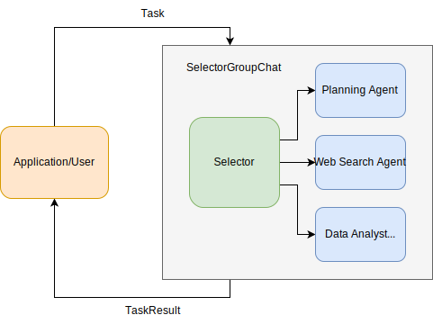
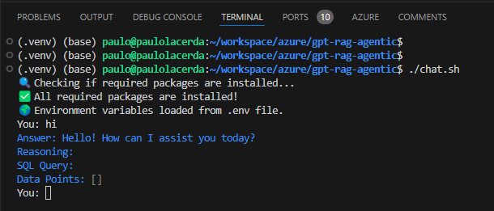

# Enterprise RAG Agentic Orchestrator

Part of [GPT-RAG](https://aka.ms/gpt-rag)

## Table of Contents

1. [**Concepts**](#concepts)
   - [1.1 How the Orchestrator Works](#how-the-orchestrator-works)
   - [1.2 Agent Strategies](#selecting-an-agent-strategy)
   - [1.3 NL2SQL and Chat with Fabric](docs/NL2SQL.md)   
   - [1.4 Create your Own Agent Strategy](#how-to-add-and-configure-you-own-agent-strategies)
2. [**Running the Orchestrator**](#running-the-orchestrator)
   - [2.1 Environment Variables](#environment-variables)
   - [2.2 Cloud Deployment](#cloud-deployment)
   - [2.3 Running the Chat Client Locally](#running-the-chat-client-locally)
   - [2.4 Running the Function Locally](docs/LOCAL_DEPLOYMENT.md)
3. [**Evaluation**](#evaluation)
4. [**Contributing**](#contributing)
5. [**Trademarks**](#trademarks)

---

## Concepts

### How the Orchestrator Works

The **GPT-RAG Agentic Orchestrator** is a powerful system that leverages AutoGen's AgetChat programming framework to facilitate collaboration among multiple specialized agents. This orchestrator is designed to handle complex tasks by coordinating the interactions of agents, each with a specific role, to produce coherent and accurate responses. For more details about AutoGen, refer to its [documentation](https://microsoft.github.io/autogen/stable/).

#### Multi-Agent Group Chat    
     
Our orchestrator employs AutoGen's `Selector Group Chat` pattern to facilitate dynamic conversations involving multiple agents. The group chat coordinates agent interactions based on the selected strategy.


<BR>*Example of a Group Chat obtained from the AutoGen documentation.*

> [!Note]
> The agents shown here are examples. You can define your own agents tailored to your use cases.

#### Agent Strategies

The orchestrator uses a factory pattern to create agents based on predefined strategies. The `AgentStrategyFactory` handles the creation of agents for each selected strategy, such as `classic_rag` or `nl2sql`. Each strategy defines a unique set of agents, their roles, and their interactions within the group chat.

Different strategies support various queries and data interactions:

- **Classic RAG Strategy (`classic_rag`)**: This strategy centers on retrieval-augmented generation, where agents collaborate to retrieve relevant information from a knowledge base and generate responses based on that information.
- **NL2SQL Strategy (`nl2sql`)**: This strategy translates natural language queries into SQL statements, enabling users to interact with databases using everyday language.

#### Elements of a Strategy:
     
- **The Agents Team**: Agents are instantiated with distinct roles and system messages. For example, in the `multimodal_rag` strategy, the agents include:    
       
   - **Assistant Agent**: Processes the user ask and invokes the necessary tools, such as `multimodal_vector_index_retrieve`, to gather relevant data. 
   - **Multimodal Message Creator**: Constructs a `MultiModalMessage` containing text and image data, ensuring the response is based on multimodal content. 
     
- **Functions used by agents**: Functions (or tools) empowers agents it with specific capabilities such as data retrieval or executing complex queries. There's no need to register tools separately, simply inform the `AssistantAgent` which tool to execute.    
     
- **Agent Selection**: Transition rules are established to control the flow of conversations between agents. The **Selector Function** defines rules for selecting the next agent to engage in the conversation based on the current context and message flow.    

#### Customization and Extensibility

The orchestrator is highly customizable, allowing developers to define custom strategies and agent behaviors. By subclassing `BaseAgentStrategy` and implementing the `create_agents` method, new strategies can be created to meet specific requirements. This extensibility ensures that the orchestrator can adapt to a wide range of operational scenarios.

### Selecting an Agent Strategy

The **GPT-RAG Agentic Orchestrator** provides a range of agent strategies to handle different types of queries and data interactions. Selecting the appropriate strategy ensures that the orchestrator operates efficiently and meets the specific needs of your application. This section outlines how to select a strategy and provides detailed descriptions of the available strategies.

### How to Select a Strategy

The orchestrator selects the agent strategy based on the `AUTOGEN_ORCHESTRATION_STRATEGY` environment variable. Be sure to set this variable to the name of the desired strategy. If you're running the chat client locally, set this variable in your shell environment. For deployments as a Function App, define it in the application settings.

#### Available Strategies

The orchestrator supports the following strategies, each tailored to specific needs:

- **Classical RAG**: The `classic_rag` strategy is the default mode of operation for the orchestrator. It is optimized for retrieving information from a predefined knowledge base indexed as an AI Search Index. This strategy leverages retrieval-augmented generation (RAG) techniques to fetch and synthesize information from existing documents or databases, ensuring accurate and relevant responses based on the available data.

- **Multimodal RAG**: In the `multimodal_rag` strategy, user queries are searched in an index containing text content and image descriptions. The system combines text and images to generate a comprehensive response.

- **NL2SQL**: The `nl2sql` strategy enables the orchestrator to convert natural language queries into SQL statements. This allows users to interact with relational databases using everyday language, simplifying data retrieval processes without the need to write complex SQL queries. Currently, this strategy is designed to execute queries on SQL databases in Azure.

- **NL2SQL Fewshot**: The `nl2sql_fewshot` strategy enhances the standard `nl2sql` approach by utilizing AI-driven search to identify similar past queries. This few-shot learning technique improves the accuracy and relevance of the generated SQL statements by learning from a limited set of examples, thereby refining the query translation process.

- **Chat with Fabric**: The `chat_with_fabric` strategy allows the orchestrator to interact with data stored in Microsoft Fabric, enabling users to query elements such as tables within both Lakehouse and semantic models. This strategy provides easy access to structured and semi-structured data in Fabric, allowing users to retrieve insights without deep knowledge of the underlying architecture.

> [!TIP]
> [Click here](docs/NL2SQL.md) for more information about **NL2SQL** and **Chat with Fabric** Strategies.

### How to Add and Configure you Own Agent Strategies

If the available strategies don’t fully meet your requirements, you can extend the orchestrator by implementing custom strategies. This flexibility lets you adapt the orchestrator’s behavior to unique use cases and operational demands.

Define custom agent strategies by specifying distinctive agent behaviors. To create a custom strategy:

1. **Subclass** `BaseAgentStrategy` and implement the `create_agents` method.
2. **Register** the strategy in `AgentStrategyFactory` for environment variable selection.

**Steps to Add a Custom Strategy:**

1. **Create the Strategy Class:**  
   Define a new strategy by inheriting from the base strategy class and specifying the required logic.
   
   ```python
   from .strategies.base_strategy import BaseAgentStrategy

   class CustomAgentStrategy(BaseAgentStrategy):
       def execute(self, query):
           # Implement custom strategy logic here
           pass
   ```

2. **Update the AgentStrategyFactory:**  
   Modify `AgentStrategyFactory` to recognize and instantiate your custom strategy.

   ```python
   from .strategies.custom_agent_strategy import CustomAgentStrategy

   class AgentStrategyFactory:
       @staticmethod
       def get_strategy(strategy_type: Strategy):
           # Existing strategy selections
           if strategy_type == 'custom':
               return CustomAgentStrategy()
           # Other strategies...
           else:
               raise ValueError(f"Unknown strategy type: {strategy_type}")
   ```

Ensure the `AUTOGEN_ORCHESTRATION_STRATEGY` environment variable is correctly set to the desired strategy name, whether a predefined strategy or a custom one you’ve implemented.

> [!NOTE]
> The name `custom` is used here as an example. You should choose a name that best represents your specific case.

---

## Running the Orchestrator

Below are the three deliverables you requested. We’ve kept only the non‐optional variables (except for BUILD_FLAGS and XDG_CACHE_HOME, which you want in app settings) and removed FUNCTION_KEY and AZURE_STORAGE_CONTAINER. The extra variables listed below are kept only in the app settings and not in the local .env file.

---

### Environment Variables

To successfully run the orchestrator Function App, you must configure the following environment variables. These variables should be defined locally using the `.env` file (following the structure from `.env.template`) and in cloud environments, such as Azure Function App, via the `app_settings.json` file in the Application Settings section.

#### App Environment Variables

| **Variable**                         | **Description** |
|--------------------------------------|-----------------|
| `APPLICATIONINSIGHTS_CONNECTION_STRING` | Connection string for Application Insights (telemetry and monitoring). |
| `AUTOGEN_ORCHESTRATION_STRATEGY`       | The agent orchestration strategy (e.g., `multimodal_rag`). |
| `AZURE_DB_ID`                        | Cosmos DB account ID (used to construct the Cosmos DB endpoint). |
| `AZURE_DB_NAME`                      | Name of the Cosmos DB database. |
| `AZURE_KEY_VAULT_NAME`               | Name of your Azure Key Vault (used for secrets retrieval). |
| `AZURE_OPENAI_API_KEY`               | API key for Azure OpenAI access. |
| `AZURE_OPENAI_API_VERSION`           | API version for Azure OpenAI (recommended: `2024-10-21`). |
| `AZURE_OPENAI_CHATGPT_DEPLOYMENT`    | Deployment name of the ChatGPT model (e.g., `chat`). |
| `AZURE_OPENAI_CHATGPT_MODEL`         | Name of the ChatGPT model (recommended: `gpt-4o`). |
| `AZURE_OPENAI_EMBEDDING_DEPLOYMENT`  | Deployment name for the embedding model. |
| `AZURE_OPENAI_EMBEDDING_MODEL`       | Name of the embedding model (recommended: `text-embedding-3-large`). |
| `AZURE_OPENAI_MAX_TOKENS`            | Maximum number of tokens allowed in responses. |
| `AZURE_OPENAI_RESOURCE`              | Azure OpenAI resource name (used to build the endpoint). |
| `AZURE_SEARCH_API_VERSION`           | Azure Search API version (recommended: `2024-07-01`). |
| `AZURE_SEARCH_APPROACH`              | Search approach to be used (recommended: `hybrid`). |
| `AZURE_SEARCH_INDEX`                 | Name of the Azure Search index (e.g., `ragindex`). |
| `AZURE_SEARCH_SEMANTIC_SEARCH_CONFIG`| Name of the semantic search configuration. |
| `AZURE_SEARCH_SERVICE`               | Azure Search service name. |
| `AZURE_SEARCH_TOP_K`                 | Maximum number of search results to return. |
| `AZURE_SEARCH_USE_SEMANTIC`          | Enable (`true`) or disable (`false`) semantic search. |
| `AZURE_STORAGE_ACCOUNT`              | Storage account name where documents are stored. |
| `PYTHON_ENABLE_INIT_INDEXING`        | `1` | Enables initial Python indexing. |
| `PYTHON_ISOLATE_WORKER_DEPENDENCIES` | `1` | Isolates Python worker dependencies. |

#### Azure Function App Specific Settings

These variables must be configured directly in Function App Service as **Application Settings**, and do not need to be included in your local `.env` file. The recommended values are provided below.

| **Variable**                         | **Recommended Value** | **Description** |
|--------------------------------------|----------------------|-----------------|
| `AzureWebJobsStorage__accountName`   | _your storage account name_ | Storage account used by Azure Functions. |
| `AzureWebJobsStorage__credential`    | `managedidentity` | Credential type for storage access. |
| `BUILD_FLAGS`                        | `UseExpressBuild` | Enables express build mode. |
| `ENABLE_ORYX_BUILD`                  | `true` | Enables the Oryx build system. |
| `SCM_DO_BUILD_DURING_DEPLOYMENT`     | `true` | Builds the app during deployment. |
| `WEBSITE_HTTPLOGGING_RETENTION_DAYS` | `1` | Number of days to retain HTTP logs. |
| `XDG_CACHE_HOME`                     | `/tmp/.cache` | Cache directory used during build/runtime. |
| `FUNCTIONS_EXTENSION_VERSION`        | `~4` | Specifies the Azure Functions runtime version. |
| `FUNCTIONS_WORKER_RUNTIME`           | `python` | Azure Functions worker runtime. |

### Cloud Deployment

There are two main options for deploying the orchestrator to the cloud:

#### **Option 1: Deploy using the Azure Developer CLI (Recommended)**
If you have previously provisioned GPT-RAG components using `azd provision`, this is the best approach, as it ensures deployment consistency with the existing infrastructure.

```bash
azd auth login
azd env refresh
azd deploy
```

This method automatically detects your environment settings, applies necessary configurations, and deploys the orchestrator with minimal manual intervention.

Ensure you have:
- [Python 3.11](https://www.python.org/downloads/release/python-3118/)
- [Azure Developer CLI](https://learn.microsoft.com/en-us/azure/developer/azure-developer-cli/install-azd) installed.

#### **Option 2: Deploy using Azure Functions Core Tools**
If you have not used `azd provision` or are deploying in a standalone manner, you can publish the Function App directly using Azure Functions Core Tools.

```bash
az login
func azure functionapp publish FUNCTION_APP_NAME --python
```

Replace `FUNCTION_APP_NAME` with the actual name of your Function App.

After deployment, verify the function is available:
```bash
func azure functionapp list-functions FUNCTION_APP_NAME
```

Ensure you have:
- [Azure Functions Core Tools](https://learn.microsoft.com/en-us/azure/azure-functions/functions-run-local?tabs=windows%2Cisolated-process%2Cnode-v4%2Cpython-v2%2Chttp-trigger%2Ccontainer-apps&pivots=programming-language-python#install-the-azure-functions-core-tools)
- [Azure CLI](https://learn.microsoft.com/en-us/cli/azure/install-azure-cli) installed.

### Running the Chat Client Locally

1. Make sure your user has the roles needed to access CosmosDB and AI Search.

### Bash
```bash
# Set variables for Cosmos DB role assignment
resourceGroupName='your resource group name'  # Name of your resource group
cosmosDbaccountName='CosmosDB Service name'   # Name of your CosmosDB account
roleDefinitionId='00000000-0000-0000-0000-000000000002'  # Built-in CosmosDB role ID for Data Contributor
principalId='Object id of your user in Microsoft Entra ID'  # Object ID of the user in Microsoft Entra ID

# Assign CosmosDB Data Contributor role to the user
az cosmosdb sql role assignment create --account-name $cosmosDbaccountName --resource-group $resourceGroupName --scope "/" --principal-id $principalId --role-definition-id $roleDefinitionId

# Set variables for Azure OpenAI role assignment
subscriptionId='your subscription id'  # Subscription ID
openAIAccountName='Azure OpenAI service name'  # Name of the Azure OpenAI service

# Assign Cognitive Services OpenAI User role
az role assignment create --role "Cognitive Services OpenAI User" --assignee $principalId --scope /subscriptions/$subscriptionId/resourceGroups/$resourceGroupName/providers/Microsoft.CognitiveServices/accounts/$openAIAccountName

# Set variables for Cognitive Search role assignment
searchServiceName='Azure Cognitive Search service name'  # Name of your Azure AI Search service

# Assign Search Index Data Reader role
az role assignment create --role "Search Index Data Reader" --assignee $principalId --scope /subscriptions/$subscriptionId/resourceGroups/$resourceGroupName/providers/Microsoft.Search/searchServices/$searchServiceName
```

### PowerShell
```powershell
# Set variables for Cosmos DB role assignment
$resourceGroupName='your resource group name'  # Name of your resource group
$cosmosDbaccountName='CosmosDB Service name'   # Name of your CosmosDB account
$roleDefinitionId='00000000-0000-0000-0000-000000000002'  # Built-in CosmosDB role ID for Data Contributor
$principalId='Object id of your user in Microsoft Entra ID'  # Object ID of the user in Microsoft Entra ID

# Assign CosmosDB Data Contributor role to the user
az cosmosdb sql role assignment create --account-name $cosmosDbaccountName --resource-group $resourceGroupName --scope "/" --principal-id $principalId --role-definition-id $roleDefinitionId

# Set variables for Azure OpenAI role assignment
$subscriptionId='your subscription id'  # Subscription ID
$openAIAccountName='Azure OpenAI service name'  # Name of the Azure OpenAI service

# Assign Cognitive Services OpenAI User role
az role assignment create --role "Cognitive Services OpenAI User" --assignee $principalId --scope /subscriptions/$subscriptionId/resourceGroups/$resourceGroupName/providers/Microsoft.CognitiveServices/accounts/$openAIAccountName

# Set variables for Cognitive Search role assignment
$searchServiceName='Azure Cognitive Search service name'  # Name of your Azure AI Search service

# Assign Search Index Data Reader role
az role assignment create --role "Search Index Data Reader" --assignee $principalId --scope /subscriptions/$subscriptionId/resourceGroups/$resourceGroupName/providers/Microsoft.Search/searchServices/$searchServiceName
``` 
2. Rename the `.env.template` file to `.env` and update the variables as needed.

3. Run `./chat.sh` (for Bash) or `./chat.ps1` (for PowerShell) to start the client locally.



### Running the Function Locally

To run the Azure Function locally, see [Testing the Solution Locally in VS Code](docs/LOCAL_DEPLOYMENT.md).

## Evaluation

An evaluation program is provided for testing the orchestrator's performance. 
<BR>Refer to the [Evaluation Documentation](docs/EVALUATION.md) for details.

## Contributing

For contribution guidelines, refer to [CONTRIBUTING.md](https://github.com/Azure/GPT-RAG/blob/main/CONTRIBUTING.md).

## Trademarks

This project may contain trademarks. Follow [Microsoft's Trademark Guidelines](https://www.microsoft.com/en-us/legal/intellectualproperty/trademarks/usage/general) for proper use.
