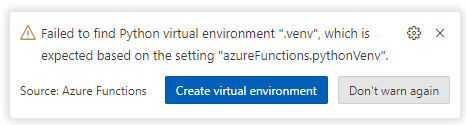
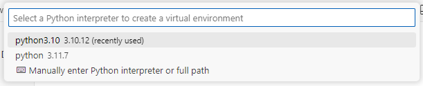

## Running locally with VS Code

To contribute, test, or debug, you can run the **orchestrator** locally in VS Code.  
   
Ensure proper provisioning of cloud resources as per instructions in the [Enterprise RAG repo](https://github.com/Azure/GPT-RAG?tab=readme-ov-file#getting-started) before local deployment of the orchestrator.

Once the cloud resources (such as CosmosDB and KeyVault) have been provisioned as per the instructions mentioned earlier, follow these steps:  
   
1. Clone this repository.  
   
2. Ensure that your VS Code has the following extensions installed:  
  
   - [Azure Functions](https://marketplace.visualstudio.com/items?itemName=ms-azuretools.vscode-azurefunctions)  
   - [Azurite (blob storage emulator)](https://marketplace.visualstudio.com/items?itemName=Azurite.azurite)  
   
3. Refer to the section below [Roles you have to ...](#roles-you-have-to-assign-to-your-user) to grant your user the necessary permissions to access the cloud resources.  
   
4. Open VS Code in the directory where you cloned the repository.  
   
5. When opening it for the first time, create a virtual environment and point it to [Python version 3.10](https://www.python.org/downloads/release/python-31011/) or higher. <BR>Follow the examples illustrated in the images below.  




   
6. Create a copy and then rename the file `local.settings.json.template` to `local.settings.json` and update it with your environment information.  
   
7. Before running the function locally, start the Azurite storage emulator. You can do this by double-clicking [Azurite Blob Service], located in the bottom right corner of the status bar.

8. Done! Now you just need to hit F5 (Start Debugging) to run the orchestrator function at  `http://localhost:7071/api/orc`.

### Roles you have to assign to your user

Since we're now using managed identities you will have to assign some roles to your user:

### Bash
```bash
# Set variables for Cosmos DB role assignment
resourceGroupName='your resource group name'  # Name of your resource group
cosmosDbaccountName='CosmosDB Service name'   # Name of your CosmosDB account
roleDefinitionId='00000000-0000-0000-0000-000000000002'  # Built-in CosmosDB role ID for Data Contributor
principalId='Object id of your user in Microsoft Entra ID'  # Object ID of the user in Microsoft Entra ID

# Assign CosmosDB Data Contributor role to the user
az cosmosdb sql role assignment create --account-name $cosmosDbaccountName --resource-group $resourceGroupName --scope "/" --principal-id $principalId --role-definition-id $roleDefinitionId

# Set variables for Azure OpenAI role assignment
subscriptionId='your subscription id'  # Subscription ID
openAIAccountName='Azure OpenAI service name'  # Name of the Azure OpenAI service

# Assign Cognitive Services OpenAI User role
az role assignment create --role "Cognitive Services OpenAI User" --assignee $principalId --scope /subscriptions/$subscriptionId/resourceGroups/$resourceGroupName/providers/Microsoft.CognitiveServices/accounts/$openAIAccountName

# Set variables for Cognitive Search role assignment
searchServiceName='Azure Cognitive Search service name'  # Name of your Azure AI Search service

# Assign Search Index Data Reader role
az role assignment create --role "Search Index Data Reader" --assignee $principalId --scope /subscriptions/$subscriptionId/resourceGroups/$resourceGroupName/providers/Microsoft.Search/searchServices/$searchServiceName
```

### PowerShell
```powershell
# Set variables for Cosmos DB role assignment
$resourceGroupName='your resource group name'  # Name of your resource group
$cosmosDbaccountName='CosmosDB Service name'   # Name of your CosmosDB account
$roleDefinitionId='00000000-0000-0000-0000-000000000002'  # Built-in CosmosDB role ID for Data Contributor
$principalId='Object id of your user in Microsoft Entra ID'  # Object ID of the user in Microsoft Entra ID

# Assign CosmosDB Data Contributor role to the user
az cosmosdb sql role assignment create --account-name $cosmosDbaccountName --resource-group $resourceGroupName --scope "/" --principal-id $principalId --role-definition-id $roleDefinitionId

# Set variables for Azure OpenAI role assignment
$subscriptionId='your subscription id'  # Subscription ID
$openAIAccountName='Azure OpenAI service name'  # Name of the Azure OpenAI service

# Assign Cognitive Services OpenAI User role
az role assignment create --role "Cognitive Services OpenAI User" --assignee $principalId --scope /subscriptions/$subscriptionId/resourceGroups/$resourceGroupName/providers/Microsoft.CognitiveServices/accounts/$openAIAccountName

# Set variables for Cognitive Search role assignment
$searchServiceName='Azure AI Search service name'  # Name of your Azure AI Search service

# Assign Search Index Data Reader role
az role assignment create --role "Search Index Data Reader" --assignee $principalId --scope /subscriptions/$subscriptionId/resourceGroups/$resourceGroupName/providers/Microsoft.Search/searchServices/$searchServiceName
``` 


### How to check what roles are assigned to CosmosDB?


#### Bash
```bash
# Set variables for Cosmos DB role assignment
resourceGroupName='your resource group name'  # Name of your resource group
cosmosDbaccountName='CosmosDB Service name'   # Name of your CosmosDB account

az cosmosdb sql role assignment list --account-name $cosmosDbaccountName --resource-group $resourceGroupName
``` 

#### PowerShell
```powershell
# Set variables for Cosmos DB role assignment
$resourceGroupName='your resource group name'  # Name of your resource group
$cosmosDbaccountName='CosmosDB Service name'   # Name of your CosmosDB account

az cosmosdb sql role assignment list --account-name $cosmosDbaccountName --resource-group $resourceGroupName
``` 